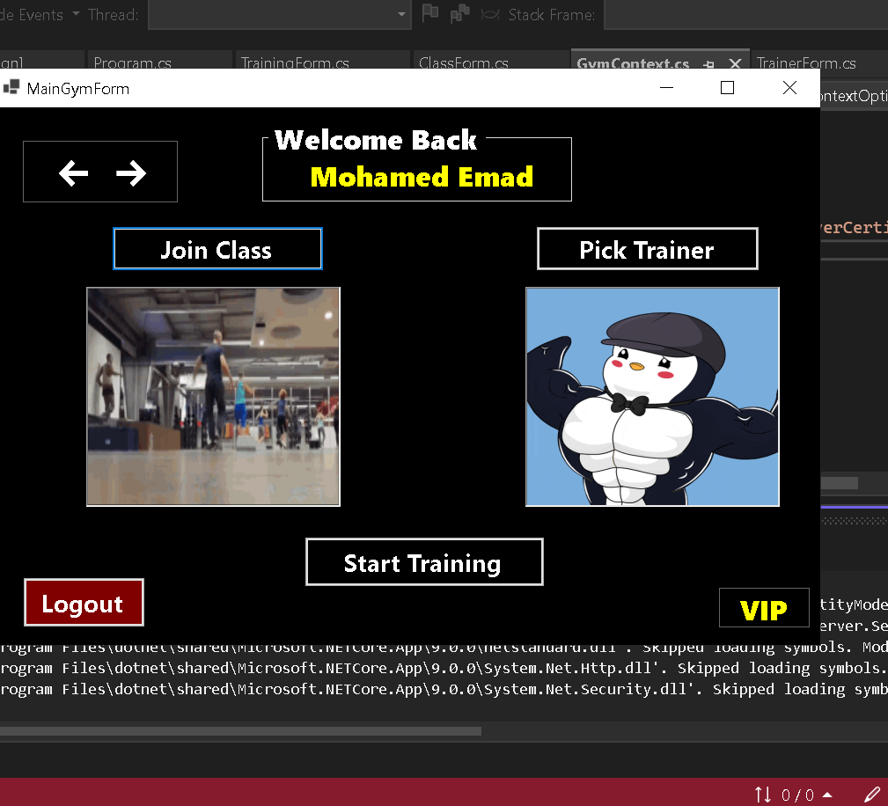
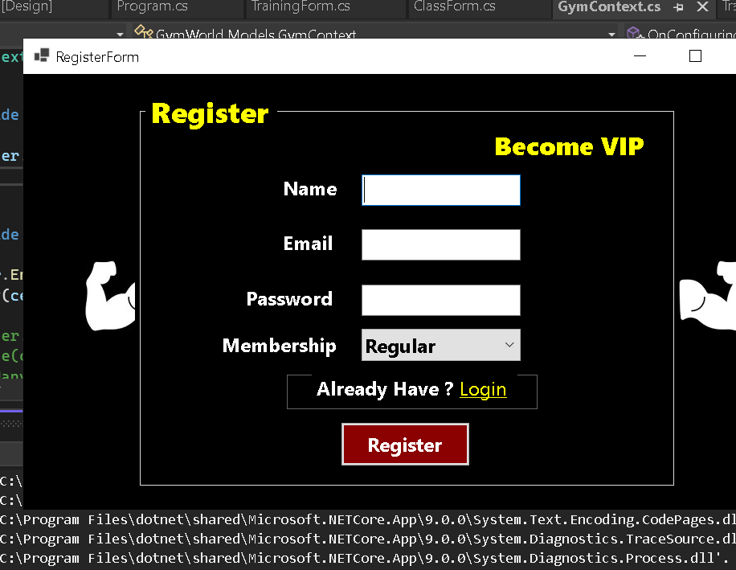
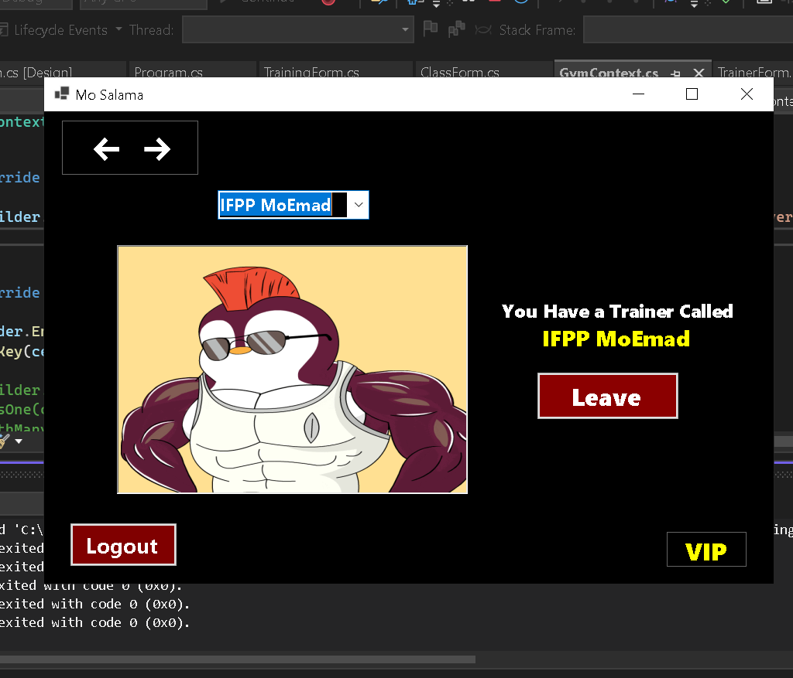
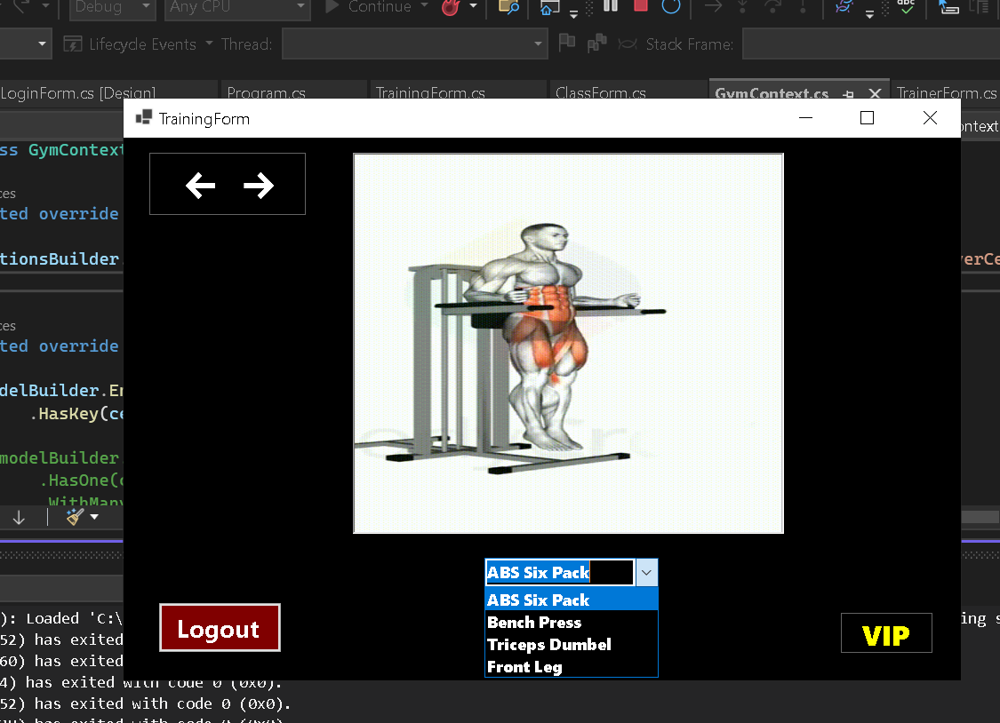

# 🏋️‍♂️ Gym Management System  

A **Windows Forms** application built using **C#** and **Entity Framework (Code First Approach)** for managing gym memberships, trainers, and training sessions.

---

## 📸 Screenshots  

### 🔹 Login Page  
  

### 🔹 Main Gym Interface  
  

### 🔹 User Registration  
  

### 🔹 Trainer Section  
  

### 🔹 Training Sessions  
  

---

## 📌 Features  

✔ **User Management** (VIP & Regular Users)  
✔ **Trainers & Class Sections**  
✔ **GIF-based Training Guidance**  
✔ **Secure Login & Registration**  
✔ **Entity Framework (Code First Approach)**  
✔ **Windows Forms UI with C#**  

---

## 🛠️ Technologies Used  

- **C# (.NET Framework)**  
- **Windows Forms (WinForms)**  
- **Entity Framework Core (Code First)**  
- **SQL Server**  
- **GitHub for Version Control**  

---

